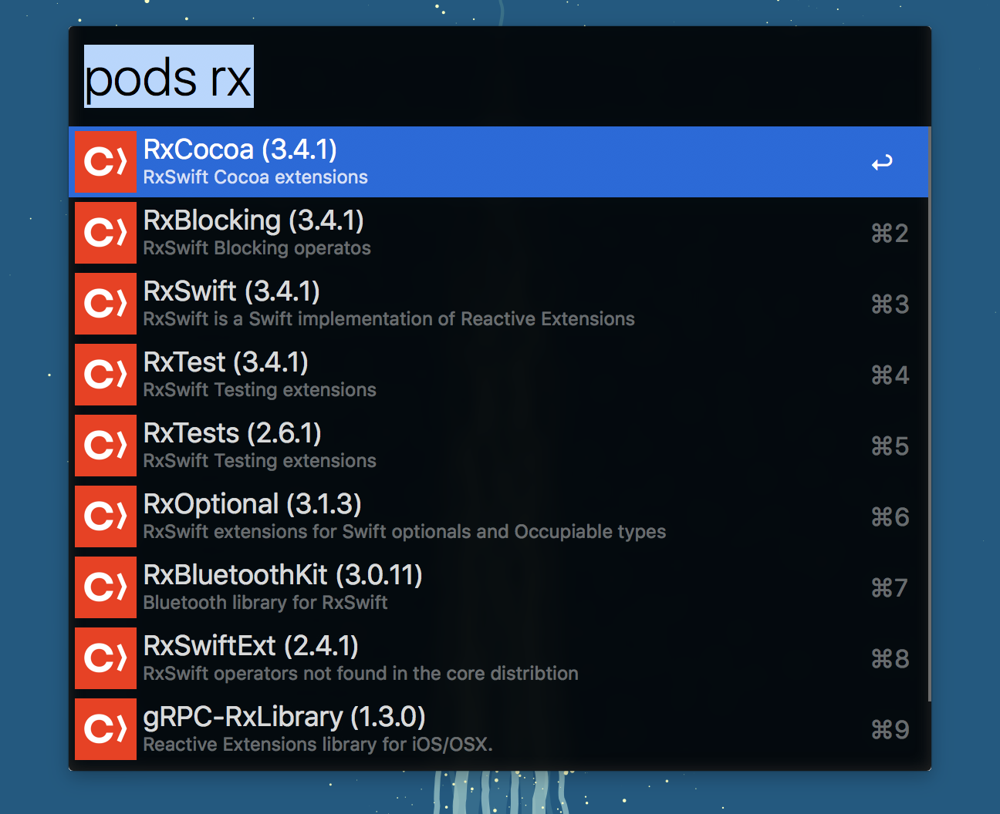

# alfred-pods [](https://travis-ci.org/nanoxd/alfred-pods)

> CocoaPods alfred workflow




## Install

```
$ npm install -g alfred-pods
```

*Requires [Node.js](https://nodejs.org) 4+ and the Alfred [Powerpack](https://www.alfredapp.com/powerpack/).*


## Usage

In Alfred, type `pods`, <kbd>Enter</kbd>, and your query.

Pressing Enter will open the CocoaPods page in your browser. If you'd like to go to the source code, you can press Option (⌥)+Enter.

While over an item, you can ⌘c to copy `pod 'QUERY'` to your clipboard.


## License

MIT © [Fernando Paredes](https://fdp.io)
